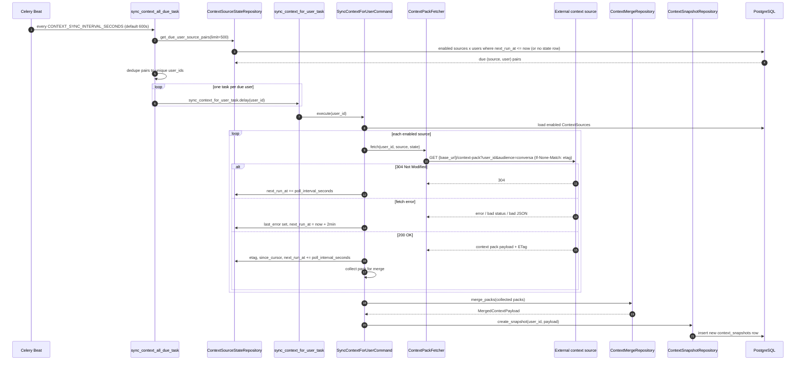
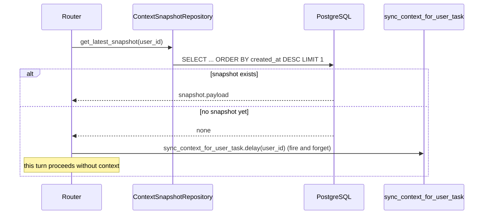

# Context sources: sync workflow

This document explains how Conversa keeps per-user context up to date from registered **context sources** — external pull endpoints (Prometheus-style) — and how that context reaches a chat request.

## The moving pieces

| Model | Purpose |
|---|---|
| `ContextSource` (`app/models/context_source.py`) | A registered external endpoint Conversa can pull user context from: `base_url`, `credential_id` (auth), `poll_interval_seconds` (default 3600s), `enabled`, `capabilities`. Managed via CRUD at `app/routers/context_sources_router.py`. |
| `ContextSourceState` | Per `(source, user)` sync bookkeeping: `last_success_at`, `last_error`, `etag` (conditional GET), `since_cursor` (incremental fetch), `next_run_at` (when this pair is next due). |
| `ContextSnapshot` | The single merged, stored result per user (`payload` JSONB + `generated_at`). This is the only thing read at chat time — no fan-out per request. |

## Sync loop (pull-based)

### Step by step

1. **Celery Beat** fires `sync_context_all_due_task` on a fixed interval (`CONTEXT_SYNC_INTERVAL_SECONDS`, default `600` seconds — see `app/infra/celery_app.py`).
2. That task calls `ContextSourceStateRepository.get_due_user_source_pairs()`, which enumerates every `(enabled source) × (user)` pair where `next_run_at <= now`, **or** no state row exists yet (so a brand-new source/user pair is always due immediately). It scans up to 200 sources × 1000 users and returns at most 500 pairs.
3. Pairs are deduped down to unique `user_id`s and **one task is enqueued per user**, not per source — `sync_context_for_user_task.delay(user_id)`. If a user has three due sources, they still get a single sync task that handles all of them.
4. `sync_context_for_user_task` runs `SyncContextForUserCommand.execute(user_id)`:
   - Loads all currently **enabled** `ContextSource`s (re-checked at execution time, not from the due-pairs snapshot).
   - For each source, calls `ContextPackFetcher.fetch()`, which `GET`s `{base_url}/context-pack?user_id=...&audience=conversa`, applying auth headers via `CredentialApplier` (source's `credential_id`), and sends `If-None-Match: <etag>` when a prior etag is known.
   - Three outcomes per source:
     - **304 Not Modified** — nothing changed; just push `next_run_at` out by `poll_interval_seconds`.
     - **Error** (network failure, non-200, invalid JSON, schema validation failure) — record `last_error`, and retry soon (`next_run_at = now + 2 minutes`, currently hardcoded regardless of `poll_interval_seconds`).
     - **200 OK** — record the new `etag`/`since_cursor`, push `next_run_at` out by `poll_interval_seconds`, and keep the pack for merging.
5. If any packs were fetched, `ContextMergeRepository.merge_packs()` combines them:
   - **Facts**: priority-winner — the first source in iteration order wins per key.
   - **Recents / pointers**: unioned with de-duplication, then capped (`RECENTS_MAX_COUNT`, `POINTERS_MAX_PER_CATEGORY`, `FACTS_MAX_BYTES`).
6. The merged payload is stored as a **new** `ContextSnapshot` row (`ContextSnapshotRepository.create_snapshot`). Snapshots are append-only — a sync never updates a row in place; the reader always asks for the latest.

## At chat time

`core/routing.py::_load_context_for_user()` never calls out to a context source directly — it only reads the existing latest snapshot:

So the first-ever message from a new user has no context (a sync is queued in the background, and the *next* message benefits from it). Every message after that reads whatever the most recent completed sync produced — there is no live fetch or blocking on external context sources during a chat request.

## Key characteristics

- **Pull model** — Conversa polls sources; sources never push to Conversa.
- **Per-pair cadence** — each `(source, user)` pair has its own `next_run_at`, driven by that source's `poll_interval_seconds`. There is no single global "sync everything" tick — Beat just checks who's due.
- **Conditional fetch** — ETag support (`If-None-Match`) avoids re-fetching/re-merging unchanged data.
- **Snapshots are a log, not a mutable row** — every successful sync inserts a new `context_snapshots` row; chat always reads the most recent one.
- **Error backoff** — a fetch error retries in 2 minutes regardless of the source's normal poll interval; a clean 304 or 200 uses the source's configured `poll_interval_seconds`.
- **Scaling caveat** — `get_due_user_source_pairs()` currently loads sources and users into Python and double-loops over them rather than filtering at the query level. Fine at current scale (200 sources / 1000 users), but would need to move to a SQL join/filter as either grows.

## Related code

- `app/models/context_source.py` — `ContextSource`, `ContextSourceState`
- `app/models/context_snapshot.py` — `ContextSnapshot`
- `app/repositories/context_source_repository.py`, `context_source_state_repository.py`, `context_snapshot_repository.py`, `context_merge_repository.py`
- `app/adapters/context_pack_fetcher.py` — HTTP fetch + conditional GET logic
- `app/commands/sync_context_for_user_command.py` — orchestrates fetch → merge → snapshot
- `app/tasks/context_sync_task.py` — Celery tasks (`sync_context_all_due_task`, `sync_context_for_user_task`)
- `app/infra/celery_app.py` — Beat schedule
- `app/core/routing.py` — chat-time snapshot read
