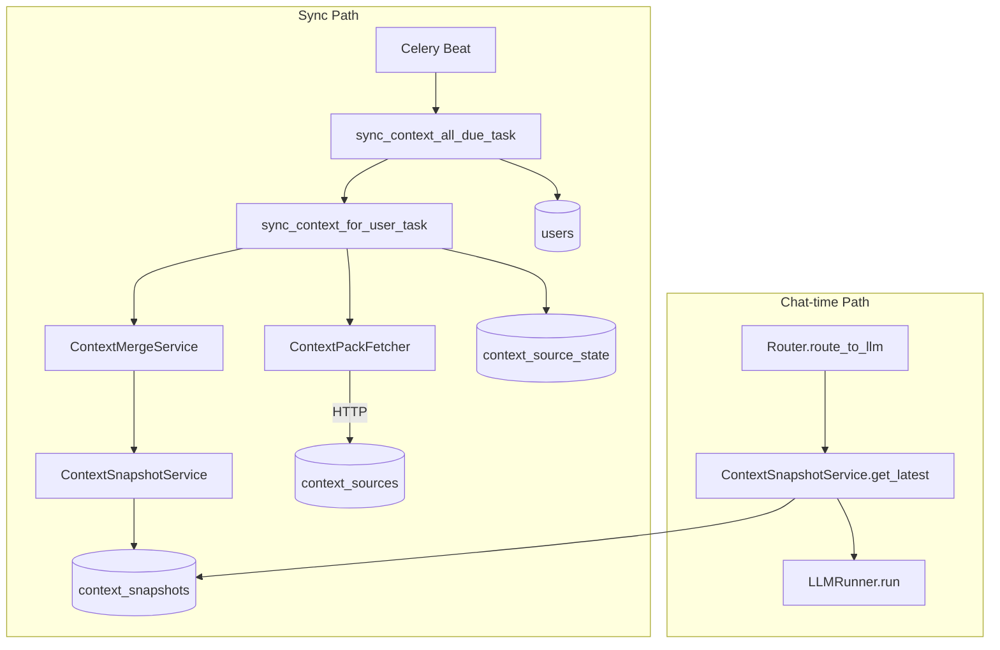

# Phase 2: Context Snapshots Implementation

This document explains how the Phase 2 context snapshot system works: syncing context packs from sources, merging them, storing snapshots, and using them at chat-time.

## Overview

Conversa periodically fetches context packs from registered sources (e.g. Linden), merges them, and stores the result in Postgres. At chat-time, the latest snapshot is loaded and passed to the LLM as structured context.



## Components

### 1. Data Model

- **context_snapshots**: Stores merged context payloads per user. Columns: `user_id`, `schema_version`, `generated_at`, `payload` (JSONB), `payload_hash`, `created_at`.
- **context_source_state** (Phase 1): Per-source, per-user sync state: `etag`, `since_cursor`, `last_success_at`, `next_run_at`, etc.

### 2. Sync Worker (Celery)

- **sync_context_all_due_task**: Runs periodically via Celery Beat. Enumerates (source, user) pairs due for sync and enqueues one task per user.
- **sync_context_for_user_task**: For a given user, fetches context packs from all enabled sources, merges them, and stores the snapshot.

Sync flow per source:

1. Call `GET {base_url}/v1/context-pack?user_id={user_id}&audience=conversa`
2. Use `If-None-Match: {etag}` when available. On 304: update state only, skip merge/store.
3. On success: validate payload, update state, collect pack for merge.
4. On error: update state with backoff, log, and continue with other sources.

### 3. Merge Logic

`ContextMergeService.merge_packs` combines multiple source packs:

- **facts**: Priority winner (first source wins per key)
- **recents**: Union with deduplication
- **pointers**: Union per category with deduplication
- Size caps: facts (8KB), recents (50 items), pointers (100 per category)

### 4. Chat-time Read Path

In `Router.route_to_llm`:

1. After `get_or_create_session`, if `session.user_id` exists:
2. Fetch latest snapshot via `ContextSnapshotService.get_latest_snapshot(user_id)`.
3. If found: pass `context=snapshot.payload` to `LLMRunner.run`.
4. If not found: pass `context=None` and enqueue `sync_context_for_user_task` for next time.

### 5. LLM Integration

`LLMRunner.run` accepts `context: Optional[dict]`. When present, a "User context" block is appended to the system prompt with serialized facts, recents, and pointers.

## Configuration

| Env | Default | Description |
|-----|---------|-------------|
| `CONTEXT_SYNC_INTERVAL_SECONDS` | 600 (10 min) | How often Celery Beat runs `sync_context_all_due_task` |

## Running the Sync Worker

1. Start Redis (broker for Celery).
2. Start Celery worker: `poetry run worker` (or `celery -A app.infra.celery_app worker -l info`).
3. Start Celery Beat (to run periodic sync): `celery -A app.infra.celery_app beat -l info`.

Beat schedules `sync_context_all_due_task` every `CONTEXT_SYNC_INTERVAL_SECONDS` seconds.

## Metrics

| Metric | Type | Description |
|--------|------|-------------|
| `context_snapshot_age_seconds` | Gauge | Age of latest snapshot (set at chat-time) |
| `context_sync_total` | Counter | Sync attempts by `source_id` and `status` (success/failure) |
| `context_pack_payload_bytes` | Histogram | Payload size in bytes by `source_id` |

## Database Migration

Run the Phase 2 migration to create `context_snapshots`:

```bash
alembic upgrade head
```

## Manual Sync (HTTP)

Trigger sync for a specific user via API:

```
POST /context-sources/sync/{user_id}
```

Requires auth and `context_source:update` permission. Returns `{"user_id": "...", "status": "synced"}` on success.

## Source Setup

1. Register a context source (e.g. Linden) via the context sources API or DB.
2. Configure `base_url`, `credential_id`, `poll_interval_seconds`, `enabled`.
3. The source must expose `GET /v1/context-pack?user_id={uuid}&audience=conversa`.
4. Optional: return `ETag` and support `If-None-Match` for 304 responses.

## Enqueue on Miss

When a user has no snapshot, the routing layer enqueues `sync_context_for_user_task` so the next chat can use a freshly synced snapshot. The current chat proceeds with minimal context (`context=None`).
