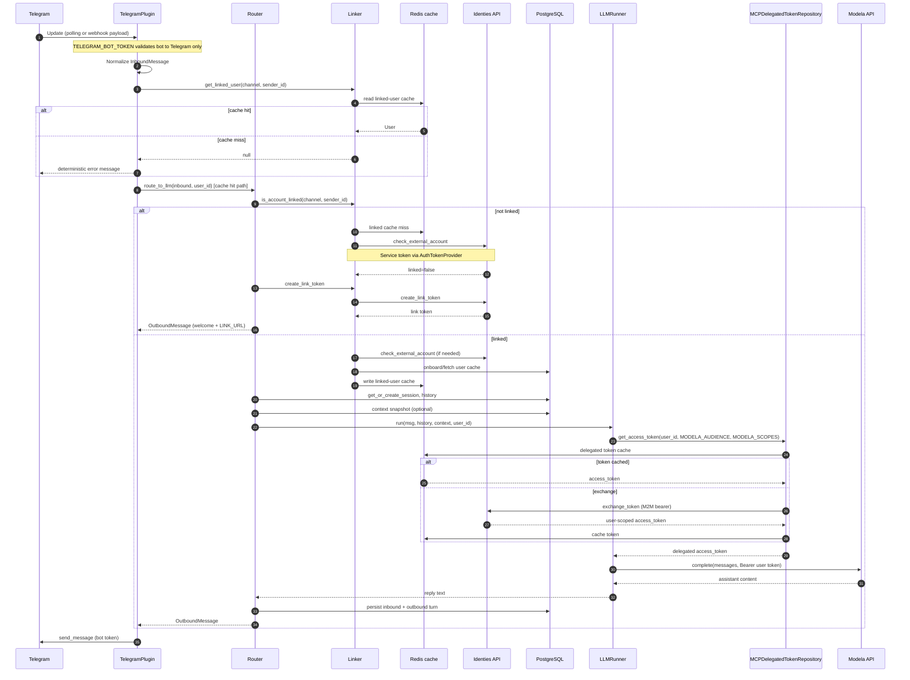
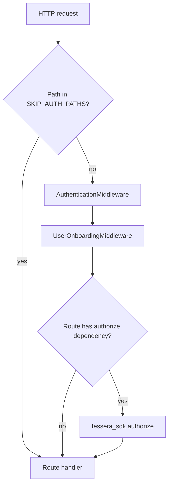

# Telegram message workflow (Telegram → Conversa)

This document describes how an inbound Telegram message is handled inside Conversa, with emphasis on **authentication** and where **RBAC** applies.

## Two entry paths (important)

Conversa exposes two different surfaces:

| Surface | How Telegram arrives | JWT / Tessera auth middleware |
|--------|----------------------|-------------------------------|
| **Channel plugin** (chat) | `python-telegram-bot` long polling (default) or optional webhook update processing | **Not used** — no `Authorization` header on chat events |
| **REST API** (`/sessions`, `/credentials`, …) | HTTP from clients / Linden app | **Used** — `AuthenticationMiddleware` + RBAC on protected routes |

The diagram below is the **channel plugin** path, which is what end users hit when they message the bot.

## High-level sequence

## Step-by-step (channel path)

### 1. Telegram transport

- **Startup**: [`app/main.py`](https://github.com/tesserahq/conversa/blob/main/app/main.py) lifespan registers [`TelegramPlugin`](https://github.com/tesserahq/conversa/blob/main/app/channels/plugins/telegram/plugin.py) when `TELEGRAM_ENABLED` and `TELEGRAM_BOT_TOKEN` are set.
- **Default mode**: long **polling** (`TelegramConfig.mode = "polling"`). The plugin registers `MessageHandler` → `_on_update`.
- **Webhook mode**: config supports `webhook` and `process_webhook_update()`; the same `_on_update` logic runs after the update is parsed. A public HTTP route for webhooks is not wired in `main.py` today—polling is the typical deployment.
- **Credential**: `TELEGRAM_BOT_TOKEN` proves Conversa is allowed to call the Telegram Bot API (send/receive). This is **not** end-user JWT auth.

### 2. Normalization

[`TelegramPlugin._on_update`](https://github.com/tesserahq/conversa/blob/main/app/channels/plugins/telegram/plugin.py) maps the Telegram `Update` to [`InboundMessage`](https://github.com/tesserahq/conversa/blob/main/app/channels/envelope.py): `channel=telegram`, `sender_id`, `chat_id`, `message_id`, `text`, `timestamp`, `raw`.

### 3. Linked-user guard in plugin

Before routing, the plugin calls `Linker.get_linked_user()` as a cache lookup. If the linked user is missing, the plugin now returns a deterministic user-facing error message and does not continue to `route_to_llm`.

### 4. Router — account linking (Identies, service identity)

[`Router.route_to_llm`](https://github.com/tesserahq/conversa/blob/main/app/core/routing.py):

**Unlinked sender**

1. `Linker.get_or_resolve_linked_user()` → cache first, then [`IdentiesClient.check_external_account`](https://github.com/tesserahq/conversa/blob/main/app/core/linker.py) on miss.
2. Identies calls use a **service token**: `AuthTokenProvider().get_token()` (`IDENTIES_API_KEY` or Auth0 M2M fallback).
3. `Linker.generate_link_token()` → `IdentiesClient.create_link_token(platform, external_user_id)`.
4. Router returns a welcome message with `LINK_URL` (no LLM, no DB session for chat logic beyond what link flow needs).

**Linked sender**

1. Identies confirms link; user is onboarded into Conversa DB if missing (`UserRepository.onboard_user`).
2. Linked user is cached in Redis for 24h and returned to router.
3. Router resolves an authoritative `user_id` and opens a DB session: `SessionManager.get_or_create_session`, loads history, optional context snapshot, optional MCP toolsets (loaded but not passed to Modela today).

**RBAC**: **none** on this path. Authorization is “is this Telegram `sender_id` linked to a Linden user in Identies?”

### 5. LLM — Modela with delegated **user** token

[`LLMRunner.run`](https://github.com/tesserahq/conversa/blob/main/app/workers/llm.py) requires `user_id` (from `session.user_id`).

| Step | Auth type | Mechanism |
|------|-----------|-----------|
| Delegated token | User-scoped | [`MCPDelegatedTokenRepository.get_access_token`](https://github.com/tesserahq/conversa/blob/main/app/repositories/mcp_delegated_token_repository.py) |
| M2M (internal) | Service | `M2MTokenClient().get_token_sync()` used only inside the repository to call Identies |
| Exchange | User delegation | `IdentiesClient.exchange_token(user_id, requested_audience=MODELA_AUDIENCE, requested_scope=MODELA_SCOPES)` |
| Modela call | User bearer | `ModelaClient(api_token=delegated_token).complete(...)` |

Config (Conversa `Settings`):

- `MODELA_AUDIENCE` / `MODELA_SCOPES` — passed to Identies exchange (defaults: `modela`, `modela:chat:complete`).
- `LLM_MODEL` — model id sent to Modela.
- `MODELA_API_URL` — Tessera SDK setting for Modela base URL.

The delegated token is cached in Redis (`mcp_delegated_tokens` namespace) keyed by `user_id`, audience, and scopes.

### 6. Outbound reply

[`TelegramPlugin.send`](https://github.com/tesserahq/conversa/blob/main/app/channels/plugins/telegram/plugin.py) uses the same bot token to `send_message` back to `chat_id`.

### 7. Account linked (async, related)

When the user completes linking in Linden, Identies can emit `com.identies.external_account.linked` on NATS. [`process_nats_event_task`](https://github.com/tesserahq/conversa/blob/main/app/tasks/process_nats_event_task.py) sends a confirmation DM via the bot token and records it on the session. That path also does **not** use FastAPI JWT middleware.

---

## REST API path (for comparison)

Administrative and session HTTP APIs go through FastAPI middleware in [`create_app`](https://github.com/tesserahq/conversa/blob/main/app/main.py):

**Skipped paths** (no JWT): `/livez`, `/readyz`, `/docs`, `/metrics`, `/oauth/slack/callback`.

**Typical protected route** (example: [`sessions_router`](https://github.com/tesserahq/conversa/blob/main/app/routers/sessions_router.py)):

1. `Depends(get_current_user)` — resolves JWT to a Tessera user.
2. `Depends(rbac["read"])` — [`build_rbac_dependencies`](https://github.com/tesserahq/conversa/blob/main/app/auth/rbac.py) → `authorize(resource="conversa.session", action="read", domain="*")`.

RBAC resources use the prefix `conversa.<resource>` (e.g. `conversa.session`, `conversa.mcp_server`). Actions: `create`, `read`, `update`, `delete`.

Telegram chat **does not** call these routers for inbound messages.

---

## Auth summary table

| Layer | Who is authenticated | Token / secret | Used for |
|-------|-------------------|----------------|----------|
| Telegram Bot API | Conversa service | `TELEGRAM_BOT_TOKEN` | Receive updates, send replies |
| Identies (link check, link token) | Conversa service | `AuthTokenProvider` / M2M | `check_external_account`, `create_link_token`, `get_internal_user` |
| Identies (token exchange) | Conversa service → on behalf of user | M2M → `exchange_token` | Delegated user access token |
| Modela | End user (delegated) | User `access_token` from exchange | `POST /chat/completions` |
| FastAPI REST | API caller (human/service) | JWT Bearer | Admin/session/credential APIs + RBAC |

---

## Key files

| Concern | File |
|---------|------|
| Telegram inbound/outbound | [`app/channels/plugins/telegram/plugin.py`](https://github.com/tesserahq/conversa/blob/main/app/channels/plugins/telegram/plugin.py) |
| Routing + linking gate | [`app/core/routing.py`](https://github.com/tesserahq/conversa/blob/main/app/core/routing.py), [`app/core/linker.py`](https://github.com/tesserahq/conversa/blob/main/app/core/linker.py) |
| Modela + delegated auth | [`app/workers/llm.py`](https://github.com/tesserahq/conversa/blob/main/app/workers/llm.py), [`app/repositories/mcp_delegated_token_repository.py`](https://github.com/tesserahq/conversa/blob/main/app/repositories/mcp_delegated_token_repository.py) |
| RBAC helpers | [`app/auth/rbac.py`](https://github.com/tesserahq/conversa/blob/main/app/auth/rbac.py) |
| HTTP auth middleware | [`app/main.py`](https://github.com/tesserahq/conversa/blob/main/app/main.py) (Tessera SDK middleware) |
| Linked-account NATS handler | [`app/tasks/process_nats_event_task.py`](https://github.com/tesserahq/conversa/blob/main/app/tasks/process_nats_event_task.py) |

---

## Environment variables (chat path)

| Variable | Role |
|----------|------|
| `TELEGRAM_ENABLED`, `TELEGRAM_BOT_TOKEN` | Enable plugin and Telegram API auth |
| `IDENTIES_HOST` / Identies URL (SDK) | Identies base URL |
| M2M / `IDENTIES_API_KEY` (via `AuthTokenProvider`) | Service calls to Identies |
| `LINK_URL` | Template for user-facing account link |
| `MODELA_API_URL`, `MODELA_AUDIENCE`, `MODELA_SCOPES` | Modela + delegated exchange |
| `LLM_MODEL` | Model passed to Modela |
| Redis | Linked-user cache + delegated token cache |
